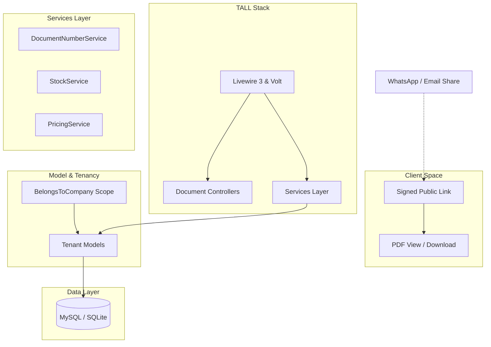

# Sales Management System SaaS

An all-in-one, multi-tenant SaaS Sales Management Platform built using the modern **Laravel 13 TALL Stack** (Laravel, Livewire 3/Volt, Alpine.js, and Tailwind CSS). 

This platform enables businesses to seamlessly manage customer relationships, generate quotations, dispatch delivery orders, track inventory, invoice clients, record payments, and analyze financial reports.

---

## ⚡ Core Highlights

*   **Multi-Tenancy & Data Isolation**: Secure data boundaries using a single-database design. Every tenant's records are isolated via `company_id` global query scopes.
*   **WhatsApp-Ready Public Sharing**: Securely share documents (Quotations, Invoices, Delivery Orders, Receipts) using cryptographically signed public URLs. External clients can view and print PDF documents without creating an account.
*   **Dynamic Interactive UI**: Real-time calculated fields (subtotals, taxes, discounts) using Livewire dynamic rows and components.
*   **Document Sequence Generator**: Collision-free document numbering sequence per company (`QT-YYYY-XXXX`, `INV-YYYY-XXXX`) powered by database-level locks (`lockForUpdate()`).
*   **Stock Ledger Integration**: Real-time stock movements triggered automatically by Sales/Purchase fulfillment workflows (e.g., Delivery Orders, Purchase Order reception).
*   **LHDN e-Invoice (MyInvois) Compliance**: Submit invoices to the Malaysian IRBM MyInvois system end to end — UBL 2.1 JSON mapping, X.509 digital signing, OAuth2 submission, status polling, 72-hour cancellation, and a scannable QR + UUID on validated invoice PDFs.
*   **AI Business Advisor**: An admin-only assistant that turns an aggregated, anonymised financial snapshot into a written review and answers free-form questions — provider-agnostic (any OpenAI-compatible endpoint) with token-by-token streaming.

---

## 🏗️ Architecture



---

## 📦 System Modules (17 Core Components)

The platform is modularly built across seventeen essential business workflows:

### 1. 📊 Dashboard
*   Real-time counters for monthly sales, unpaid/overdue invoice totals, pending quotations, and low-stock alerts.
*   Interactive charts visualising 12-month sales pipelines.
*   Activity feeds detailing recent company transactions.

### 2. 👥 Customers
*   Full CRM profiles with separate billing/shipping addresses, tax numbers, and status toggles.
*   Unique credit limits per customer to manage risk.
*   Associated price levels for automatic pricing rules.

### 3. 🛍️ Products & Services
*   Unified catalog listing physical inventory items and digital services.
*   Configuration options for SKU, category, units of measure, cost, sell price, tax rates, and stock-tracking flags.

### 4. 🏷️ Price Levels & Discounts
*   Custom customer price levels (e.g., Retail, Wholesale, VIP) with custom selling prices.
*   Global or category-specific discounts (percentage or fixed-amount) with date ranges.

### 5. 📄 Quotations
*   Live constructor: Dynamic row updates recalculating subtotals, tax rates, discounts, and totals on-the-fly.
*   Status tracking (`Draft`, `Sent`, `Accepted`, `Rejected`, `Expired`).
*   One-click conversion into a **Sales Order**.

### 6. 🛒 Sales Orders
*   Intermediary verification checkpoint converted from accepted quotations or built manually.
*   One-click generation of related **Delivery Orders** and **Invoices**.

### 7. 🚚 Delivery Orders
*   Fulfillment orders tracking items ready to be shipped.
*   Transitioning a DO to `Delivered` triggers an automatic `Stock OUT` movement in the inventory ledger.

### 8. 💳 Invoices
*   Comprehensive invoice generator with user-defined credit terms and due dates.
*   Automated billing state tracking: `Draft`, `Sent`, `Partially Paid`, `Paid`, `Overdue`, and `Void`.

### 9. 💵 Payments
*   Register cash, bank transfers, e-wallets, cards, or cheque payments against invoices.
*   Supports multiple partial payments, auto-updating the parent invoice state.

### 10. 🧾 Receipts
*   Auto-generated payment receipts immediately following payment records.
*   Unique receipt transaction numbers (`RC-YYYY-XXXX`) with downloadable customer PDFs.

### 11. 🏢 Suppliers
*   Profiles containing registration info, tax numbers, and contact details for procurement.

### 12. 📥 Purchase Orders
*   Procurement pipeline mapping orders sent to suppliers.
*   Completing/receiving goods automatically issues a `Stock IN` record in the inventory.

### 13. 📦 Inventory / Stock
*   Real-time stock ledger logging movements (`IN`, `OUT`, `Adjustment`) and tracking average cost history.
*   Manual stock adjustments (stocktakes) and threshold warning logs for low-running stock.

### 14. 💸 Expenses
*   Customizable expense categories.
*   Payment logs tracking operational expenses with receipt file attachments.

### 15. ⚙️ Settings
*   Comprehensive tenant control center:
    *   **Company Profile**: Business name, registration numbers, addresses, contact details, and custom logo upload.
    *   **Document Prefixes**: Custom nomenclature for invoice, quotation, DO, and receipt running sequences.
    *   **User Directory**: Multi-user permissions managed using Spatie Role Permissions (`super-admin`, `admin`, `staff`).
    *   **e-Invoice Profile**: Company TIN, SST registration, MSIC code, and structured address for LHDN MyInvois.

### 16. 🧾 e-Invoice (LHDN MyInvois)
*   End-to-end Malaysian e-Invoice compliance, submitted straight from the invoice screen.
*   `InvoiceDocumentBuilder` maps an invoice to the **UBL 2.1 JSON** structure; `DocumentSigner` applies a real **XAdES-in-JSON X.509 signature** from a configured `.p12/.pfx` certificate.
*   `MyInvoisClient` handles OAuth2 (client credentials), document submission, status lookup, and cancellation against the sandbox/production endpoints.
*   Per-invoice actions: **Submit**, **Check Status**, **Resubmit** (after rejection), and **Cancel** (with reason, within LHDN's 72-hour window); status badge, UUID, and validation link.
*   Validated invoices render a **scannable QR code + UUID** on the PDF. A scheduled `einvoice:poll-status` command refreshes pending submissions every 15 minutes.
*   Compliance fields captured on companies, customers, and products (TIN, registration type/no, SST, classification/UOM/tax-type codes). Disabled by default — enable via `MYINVOIS_*` env.

### 17. 🤖 AI Business Advisor
*   Admin-only assistant that interprets the company's finances and gives actionable advice.
*   **One-click Financial Review** (structured markdown) and a **chat panel** with token-by-token streaming, answering in the user's language (BM/English).
*   **Privacy-first**: only an aggregated, anonymised snapshot is sent — P&L vs. previous period, receivables aging, 12-month trend, top products, expense breakdown, low-stock alerts — **never customer names or PII**.
*   **Provider-agnostic**: any OpenAI-compatible Chat Completions endpoint (OpenAI, OpenRouter, Azure, Groq, or a local Ollama/LM Studio/vLLM server). Disabled by default — enable via `AI_*` env.

---

## 🛠️ Technology Stack

*   **Backend Framework**: Laravel 13 (PHP 8.3+)
*   **Frontend Components**: Livewire 3 (Volt), Alpine.js
*   **Styling Engine**: Tailwind CSS 4
*   **Database Systems**: MySQL 8+ (SQLite for dev/testing environments)
*   **Authentication & RBAC**: Laravel Breeze & `spatie/laravel-permission`
*   **PDF Exporter**: `barryvdh/laravel-dompdf`
*   **Spreadsheet Exporter**: `maatwebsite/excel`
*   **QR Codes**: `simplesoftwareio/simple-qrcode` (e-Invoice validation QR)
*   **e-Invoice**: LHDN MyInvois API (OAuth2 + UBL 2.1 JSON + X.509 signing)
*   **AI**: OpenAI-compatible Chat Completions (configurable provider)
*   **Test Framework**: Pest PHP

---

## ⚙️ Local Development Setup

Follow these instructions to run the application locally:

### 1. Prerequisites
Ensure you have PHP 8.3+, Composer, and Node.js installed. Alternatively, you can use the pre-packaged binaries included in the `tools/` directory.

### 2. Clone and Install Dependencies
Install PHP libraries and Node packages:
```bash
composer install
npm install
```

### 3. Environment Configuration
Copy the environment variables and generate an application key:
```bash
cp .env.example .env
php artisan key:generate
```

Configure your `.env` database parameters:
```env
DB_CONNECTION=mysql
DB_HOST=127.0.0.1
DB_PORT=3306
DB_DATABASE=sales_management_db
DB_USERNAME=root
DB_PASSWORD=
```
*(Alternatively, you can use SQLite by setting `DB_CONNECTION=sqlite` and configuring `DB_DATABASE` to point to a `.sqlite` database file)*.

#### Optional: LHDN e-Invoice (MyInvois)
Off by default. Enable and provide your MyInvois Portal credentials plus an X.509 signing certificate:
```env
MYINVOIS_ENABLED=true
MYINVOIS_ENVIRONMENT=sandbox          # sandbox (preprod) or production
MYINVOIS_CLIENT_ID=
MYINVOIS_CLIENT_SECRET=
MYINVOIS_CERT_PATH=/path/to/cert.p12  # X.509 .p12/.pfx for document signing
MYINVOIS_CERT_PASSWORD=
```

#### Optional: AI Business Advisor
Off by default. Point it at any OpenAI-compatible Chat Completions endpoint:
```env
AI_ENABLED=true
AI_API_KEY=
AI_MODEL=gpt-4o-mini
AI_BASE_URL=https://api.openai.com/v1 # change for OpenRouter / Azure / local
```

### 4. Database Setup & Seeding
Create the database and seed the default roles, a demo company, and a demo administrator:
```bash
php artisan migrate --seed
```

The seeder creates a default administrator account:
*   **User Email**: `admin@example.com`
*   **Password**: `password`

### 5. Running the Application
Run the local Laravel development server and build assets:
```bash
# Start local PHP server & Vite bundler
npm run dev
```

If you are using the pre-packaged PHP binaries located in `tools/php/`:
```bash
# Start serving using local php binary
tools/php/php.exe artisan serve
```

---

## 🧪 Testing Suite

We use **Pest PHP** to enforce robust tenant isolation and business logic validation.

To run the automated tests:
```bash
# Run unit and feature test suites
php artisan test
```

Using the pre-packaged PHP binary:
```bash
tools/php/php.exe artisan test
```

Tests include coverage for:
*   **Tenancy Security**: Asserting that User A (Company A) cannot read, create, update, or delete data belonging to Company B.
*   **Document Number Service**: Ensuring lock-protected, non-overlapping sequential document numbers.
*   **Business Operations**: End-to-end simulation of the Quotation → Sales Order → Delivery Order → Invoice → Payment → Receipt pipeline.
*   **e-Invoice (MyInvois)**: UBL 2.1 mapping, readiness/PII/tenancy checks, sandbox submit/status/cancel (HTTP mocked), a cryptographically-verified X.509 signature, duplicate-submission guard, and PDF+QR rendering.
*   **AI Advisor**: Aggregated snapshot accuracy, PII-free payload enforcement, and review/chat/streaming via a mocked endpoint.
