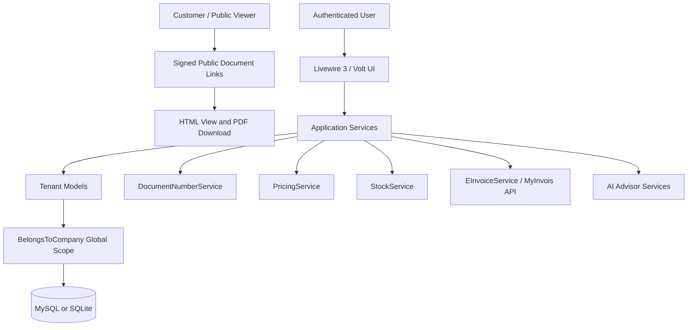

# Sales Management SaaS

A multi-tenant sales management platform for Malaysian SMEs, built with Laravel 13, Livewire 3, Volt, Alpine.js, and Tailwind CSS.

The application covers the daily sales workflow from customer and product setup through quotations, sales orders, delivery orders, invoices, payments, receipts, rebates, inventory movements, expenses, reporting, LHDN MyInvois e-Invoice submission, and an optional AI business advisor.

## Highlights

- Multi-tenant data isolation using a single database and `company_id` scoped tenant models.
- End-to-end document workflow: quotation -> sales order -> delivery order -> invoice -> payment -> receipt.
- Signed public document links for customers, suitable for WhatsApp or email sharing without requiring customer accounts.
- PDF exports for quotations, sales orders, delivery orders, invoices, and receipts.
- Per-company document numbering backed by database locks through `DocumentNumberService`.
- Inventory stock ledger with automatic stock-out on delivered delivery orders and stock-in on received purchase orders.
- Customer price levels, product-specific pricing, discounts, and tax-aware line calculations.
- RBAC with `super-admin`, `admin`, and `staff` roles through Spatie Laravel Permission.
- LHDN MyInvois integration with UBL 2.1 JSON mapping, X.509 signing, submission, polling, cancellation, UUID, and QR display.
- Optional AI business advisor using an OpenAI-compatible Chat Completions endpoint.

## Tech Stack

- PHP 8.3+
- Laravel 13
- Livewire 3 and Volt
- Alpine.js
- Tailwind CSS
- Vite
- MySQL 8+ or SQLite
- Laravel Breeze authentication
- Spatie Laravel Permission
- DomPDF for PDF output
- Laravel Excel for report exports
- Simple QR Code for e-Invoice QR rendering
- Pest PHP for tests

## Main Modules

- Dashboard: monthly sales, unpaid and overdue invoice totals, pending quotations, low-stock alerts, charts, and activity feeds.
- Customers: CRM records, billing and shipping addresses, tax details, credit limits, and price levels.
- Products and categories: physical products and services, SKU, UOM, cost, selling price, tax settings, and stock tracking.
- Price levels and discounts: customer-specific pricing and date-bound fixed or percentage discounts.
- Quotations: draft, send, accept, reject, expire, and convert into sales orders.
- Sales orders: confirmation checkpoint with one-click creation of delivery orders and invoices.
- Delivery orders: fulfillment records that can trigger stock-out movements when delivered.
- Invoices: credit terms, due dates, payment status tracking, e-Invoice actions, and PDF output.
- Payments and receipts: partial payments, payment methods, receipt generation, and receipt PDFs.
- Rebates: rebate records against fully paid invoices without reopening the invoice payment status.
- Suppliers and purchase orders: procurement workflow and stock-in handling for received goods.
- Inventory: stock movement ledger, stock adjustments, and product-level stock history.
- Expenses: expense categories, payments, and receipt attachment support.
- Reports: sales, outstanding invoices, payments, expenses, profit and loss, and exportable report data.
- Settings: company profile, logo, document prefixes, invoice terms, users, roles, and MyInvois profile fields.
- AI advisor: admin-only financial review and chat from aggregated, anonymised company data.

## Architecture



## Requirements

- PHP 8.3 or newer
- Composer
- Node.js and npm
- SQLite for local development, or MySQL 8+ for shared/staging/production environments

The repository also includes a `tools/` directory for environments that use packaged binaries.

## Local Setup

Install PHP and Node dependencies:

```bash
composer install
npm install
```

Create the environment file and application key:

```bash
cp .env.example .env
php artisan key:generate
```

For SQLite development, create the local database file if it does not already exist:

```bash
touch database/database.sqlite
```

Then run migrations and seed the demo company, roles, and admin user:

```bash
php artisan migrate --seed
```

Default seeded login:

- Email: `admin@example.com`
- Password: `password`

## Running Locally

Start the full development stack with Laravel, queue worker, log tailing, and Vite:

```bash
composer run dev
```

Or run Laravel and Vite in separate terminals:

```bash
php artisan serve
npm run dev
```

Build production assets:

```bash
npm run build
```

## Environment Configuration

The default `.env.example` uses SQLite:

```env
DB_CONNECTION=sqlite
```

For MySQL:

```env
DB_CONNECTION=mysql
DB_HOST=127.0.0.1
DB_PORT=3306
DB_DATABASE=sales_management_db
DB_USERNAME=root
DB_PASSWORD=
```

Queues and scheduled jobs are database-backed by default:

```env
QUEUE_CONNECTION=database
CACHE_STORE=database
SESSION_DRIVER=database
```

## Optional LHDN MyInvois e-Invoice

MyInvois is disabled by default. Enable it only after company, customer, and product compliance fields are configured.

```env
MYINVOIS_ENABLED=true
MYINVOIS_ENVIRONMENT=sandbox
MYINVOIS_CLIENT_ID=
MYINVOIS_CLIENT_SECRET=
MYINVOIS_CERT_PATH=/absolute/path/to/cert.p12
MYINVOIS_CERT_PASSWORD=
MYINVOIS_TIMEOUT=30
```

Supported invoice actions include readiness validation, submit, check status, resubmit after rejection, and cancel with a reason when allowed by MyInvois.

## Optional AI Business Advisor

The advisor is disabled by default and uses an OpenAI-compatible Chat Completions endpoint.

```env
AI_ENABLED=true
AI_BASE_URL=https://api.openai.com/v1
AI_API_KEY=
AI_MODEL=gpt-4o-mini
AI_TIMEOUT=60
AI_MAX_TOKENS=1500
AI_TEMPERATURE=0.3
AI_USE_TOOLS=false
```

The advisor sends aggregated, anonymised financial data, not customer names or other PII.

## Scheduled Commands

Laravel scheduling is configured in `routes/console.php`.

- `invoices:check-overdue` runs daily and marks eligible invoices as overdue.
- `einvoice:poll-status` runs every 15 minutes and refreshes submitted MyInvois documents when MyInvois is enabled.

In production, run the Laravel scheduler:

```bash
php artisan schedule:run
```

For normal production operation, also run a queue worker:

```bash
php artisan queue:work
```

## Testing

Run the test suite:

```bash
php artisan test
```

Or through Composer:

```bash
composer test
```

Current test coverage includes:

- Authentication and profile flows.
- Tenant isolation and company-scoped data access.
- Sales workflow smoke coverage.
- MyInvois mapping, signing, submission, status, cancellation, and PDF/QR behavior with mocked HTTP.
- AI advisor snapshot, PII guardrails, review, chat, and streaming behavior with mocked responses.

## Useful Paths

- `routes/web.php` - authenticated application routes and signed public document routes.
- `routes/console.php` - scheduled commands.
- `app/Livewire` - Livewire screens and workflows.
- `app/Models` - tenant models and business records.
- `app/Services` - document numbering, pricing, stock, MyInvois, and advisor services.
- `resources/views/pdf` - PDF templates.
- `resources/views/public` - public document views.
- `database/migrations` - database schema.
- `tests/Feature` - feature and integration tests.

## Deployment Notes

For a typical production deployment:

```bash
composer install --no-dev --optimize-autoloader
npm ci
npm run build
php artisan migrate --force
php artisan config:cache
php artisan route:cache
php artisan view:cache
```

Ensure writable permissions for `storage/` and `bootstrap/cache/`, configure a queue worker, and run Laravel's scheduler once per minute from cron.
